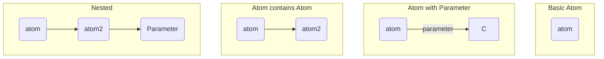

<!-- GENERATED DOCUMENT DO NOT EDIT! -->
<!-- prettier-ignore-start -->
<!-- markdownlint-disable -->

<!-- Compiled with doculisp https://www.npmjs.com/package/doculisp -->
<!-- Written By: jason-kerney -->

# Doculisp Language #

```
___  ____ ____ _  _ _    _ ____ ___
|  \ |  | |    |  | |    | [__  |__]
|__/ |__| |___ |__| |___ | ___] |
```

A language for Readme.

## Table of Contents ##

1. Intro: [Why Doculisp?](#why-doculisp)
2. Language: [Syntax Overview](#syntax-overview)
3. Language: [Doculisp Master Block](#doculisp-master-block)
4. Language: [Section Meta Block](#section-meta-block)
5. Language: [Content Block](#content-block)
6. Language: [Dynamic Headings](#dynamic-headings)
7. Language: [Comment Block](#comment-block)
8. Language: [Path Ids](#path-ids)
9. Language: [Dynamic Document Linking](#dynamic-document-linking)
10. Language: [Key Atoms by Depth](#key-atoms-by-depth)
11. Structure: [Native Doculisp Files](#native-doculisp-files)
12. Version: [Language Specification Version](#language-specification-version)
13. Recognition: [Contributors ✨](#contributors-)

## Why Doculisp? ##

### The Documentation Maintenance Problem ###

As developers, we've all been there: staring at a massive README file that's become unwieldy, outdated, and frankly intimidating to update. Traditional documentation approaches create several pain points:

- **Monolithic files** that are difficult to navigate and edit
- **Merge conflicts** when multiple contributors update different sections
- **Unclear change impact** when reviewing large file diffs
- **Context switching overhead** when editing unrelated documentation sections
- **Inconsistent structure** across different projects and teams

Doculisp solves these problems by bringing **modularity and structure** to markdown documentation.

### Why Developers Love Doculisp ###

#### 🎯 **Focused Editing** ####

Break your README into logical, manageable chunks. Need to update the installation instructions? Open just the `installation.md` file. Working on API documentation? Focus solely on `api.md`. No more scrolling through hundreds of lines to find the section you need.

#### 🔍 **Clear Change Tracking** ####

Git diffs become meaningful again. Instead of seeing "README.md changed 47 lines," you see exactly which conceptual sections were modified: `installation.md`, `troubleshooting.md`, etc.

#### 🤝 **Better Collaboration** ####

Multiple team members can work on different documentation sections simultaneously without merge conflicts. The documentation author editing the introduction won't conflict with the API maintainer updating endpoint documentation.

#### 📐 **Consistent Structure** ####

The `section-meta` blocks enforce consistent organization across all your documentation, making it easier for new team members to contribute and for users to find information.

#### ⚡ **Maintainability** ####

Small, focused files are easier to review, update, and refactor. When documentation grows, you can easily reorganize by moving files rather than cut-and-paste operations in large documents.

#### 🔄 **Effortless Restructuring** ####

Need to promote a section to its own document? Simply move the file and update the `include` block. What starts as a subsection can easily become a standalone document with its own table of contents and structure. No copy-paste, no broken links, no manual reorganization - just move files and update references.

#### 🔗 **Resilient Cross-References** ####

Every section and header can have a unique ID that enables dynamic linking within and across documents. Reference other sections with `(get-path id)` and Doculisp automatically generates the correct links. Best of all: when you restructure documentation and promote sections to standalone documents, as long as the IDs remain the same, all existing links continue to work seamlessly.

### Why Doculisp Over Other Options? ###

#### vs. Traditional Markdown ####

**Traditional approach**: One massive README.md file that becomes harder to manage over time.
**Doculisp advantage**: Modular files with structured includes, maintaining the simplicity of markdown while adding organization.

#### vs. Documentation Generators (GitBook, Docusaurus, etc.) ####

**Documentation generators**: Complex setup, learning curve, often overkill for project READMEs.
**Doculisp advantage**: Zero learning curve if you know markdown. Generates standard markdown files that work everywhere GitHub is supported.

#### vs. Wiki Systems ####

**Wiki systems**: Separate from your codebase, requires context switching, can become disconnected from code changes.
**Doculisp advantage**: Lives in your repository, versioned with your code, integrated into your development workflow.

#### vs. Raw File Splitting ####

**Manual file splitting**: No standard structure, inconsistent organization, manual assembly required.
**Doculisp advantage**: Structured metadata system, automated assembly, consistent patterns across projects.

### Getting Started: A Practical Approach ###

#### Start Simple, Grow Naturally ####

**Don't over-engineer from day one.** If your current README is manageable, keep it as-is. Doculisp shines when documentation becomes complex enough that modularization provides real value.

**Recommended progression:**
1. **Single file**: Start with a traditional README.md
2. **Natural breaking points**: When sections grow large (>50 lines) or become logically distinct, extract them
3. **Gradual adoption**: Begin with obvious candidates like installation instructions, API documentation, or troubleshooting guides
4. **Full structure**: Eventually organize into a complete Doculisp project when the benefits are clear

**Signs it's time to modularize:**
- Your README is over 200 lines
- Multiple people need to edit different sections
- You find yourself searching within the file to find specific content
- Merge conflicts are happening in documentation
- You're copying documentation patterns between projects

**Pro tip**: The goal is easier maintenance, not complexity. If splitting a small section into its own file makes editing *harder*, don't do it.

## Syntax Overview ##

The basic structure of Doculisp is all code is contained within blocks. A block is constructed within an HTML comment region. It starts with an open parentheses `(` followed by a sting of non-whitespace characters. This is called an atom. It then has 1 of three possibilities. It can have a parameter, a new block, or nothing. All blocks must close with a close parentheses `)`.

Even the Doculisp main block follows this.

Example

```markdown
<!--
(dl
    (section-meta
        (title Basic Structure)
    )
)
-->
```

The first block is the `dl` block. In it `dl` is the atom. It contains the `section-meta` sub-block.  That block has the atom `section-meta` followed by a further sub block. The last sub block is the `title` sub block. In it `title` is the atom and `Basic Structure` is the parameter.

### Parameter ###

A parameter is a string of characters that contains no line advancement (`\r` or `\n`) character and no parentheses (unless escaped). A parameter has a max length of 255 characters.

Example:

```doculisp
(atom parameter)
```

To include parentheses within a parameter, escape them with a backslash:

```doculisp
(atom parameter\))
```

### More Visual Explanations ###

```doculisp
(atom)
(atom parameter)
(atom (atom2))
(atom (atom2 second parameter))
```



## Doculisp Master Block ##

All doculisp is contained in an outer doculisp block. That block starts with `(dl` followed by a white space. This doculisp block must be contained in an html comment.

Example

```markdown
<!--
(dl
    (section-meta
        (title Doculisp)
        (include
            (Section ./doculisp.md)
        )
    )

    (content (toc numbered-labled))
)
-->
```

You will notice that in this example the doculisp contains 2 main blocks, however it is valid for the Doculisp block to contain more or less. Even zero other blocks.

## Section Meta Block ##

The `section-meta` block is a crucial part of the Doculisp DSL. It provides metadata for a section, including the title, author, and included subsections. This block helps organize and structure the documentation by breaking it into manageable parts.

### Components of the `section-meta` Block ###

1. Title (title):
    * Required
    * Specifies the title of the section.
    * Example: (title Section Meta Block)
2. Ref-Link (ref-link):
    * Optional
    * Allows you to specify a different link to use in the table of contents.
    * Useful for handling characters in the title that markdown does not include in its section headers.
3. Subtitle (subtitle):
    * Optional
    * Creates a heading that is two levels of heading less than the title directly beneath the title.
4. Author (author):
    * Optional
    * Specifies the author(s) of the section.
    * Can be included multiple times for multiple authors.
    * Example: (author jason-kerney)
5. Include (include):
    * If it is used there must be a `content` block.
    * Lists the files to be included in the section.
    * Each file is specified with a custom block name followed by the file path.
6. ID (id):
    * Optional
    * Specifies a unique identifier for the section.
    * Example: (id section-meta)
    * For more information on ids see [Path Ids](#path-ids)
    * The `id` block provides a unique identifier for the section, facilitating easy linking and navigation. See [get-path](#dynamic-document-linking) for more details.
7. Comment (*):
    * Optional
    * The comment block breaks the rule slightly. The asterisk character is a special character that causes all atoms that start with it to be treated as a comment, and all parameters and sub-blocks to be ignored.

### Section-Meta Examples ###

##### Title Example #####

```doculisp
(section-meta
    (title Section Meta Block)
)
```

##### Ref-Link Example #####

```doculisp
(section-meta
    (title Doculisp is awesome ✨)
    (ref-link doculisp_is_awesome_)
)
```

##### Subtitle Example #####

```doculisp
(section-meta
    (title Section Meta Block)
    (subtitle A Detailed Explanation)
)
```

##### Author Example #####

```doculisp
(section-meta
    (title Section Meta Block)
    (author jason-kerney)
    (author another-author)
)
```

##### Include Example #####

```doculisp
(section-meta
    (title Include Sub-Block)
    (include
        (Section ./title.md)
        (Section ./ref-link.md)
        (Section ./subtitle.md)
        (Section ./include.md)
        (*Section ./id.md) ; Commented out
        (Section ./authors.md)
        (Section ./comments.md)
    )
)
```

##### ID Example #####

(section-meta
    (title Doculisp: A Short Description)
    (id doculisp-short-description)
)

##### Comment Example #####

```doculisp
(*section-meta
    (title Doculisp)
    (include
        (Section ./doculisp.md)
        (Section ./section-meta.md)
        (Section ./content.md)
        (*section ./comment.md)
    )
)
```

### Author ###

Author is an optional block in the section meta that puts the author's name in the comments at the top and bottom of the document. This block can be included multiple times and each will have a separate comment line.

```doculisp
(section-meta
    (title An example of the Author Block)
    (author Jason Kerney)
    (author Chris Stead)
)
```

### Include ###

The `include` block allows you to break each section into sub-sections that are composed in separate files. This modular approach makes it easier to manage and edit documentation by limiting the scope of work in each file.

Example

```doculisp
(section-meta
    (title Doculisp a short description)
    (include
        (Section ./doculisp.md)
        (Section ./section-meta.md)
    )
)
```

#### Include's Subsections ####

The `include` block is composed of sub-section blocks. These blocks are different then other doculisp blocks. They are custom named blocks. Which means the name of each block is decided by the programmer the same way a variable name is. The format of these blocks is `(` followed by a name followed by whitespace. After the white space is the file path that leads to the document containing the information on how to build the sub-section. Followed again by an optional new line and whitespace. Ending in `)`.

The `include` block is composed of custom named blocks. These blocks are different from other Doculisp blocks as they are named by the programmer, similar to variable names. The biggest difference is these names can be displayed in the table of contents.

The format of these blocks is `(` followed by a name, whitespace, the file path, optional new line and whitespace, and ending with `)`.

You can add a space (` `) to a name by adding a `-` to the name.

Example:

```doculisp
(include
    (Chapter
        ./information/one.md
    )
)
```

This will create a subsection called `Chapter` that is built using the file `./information/one.md`.

Example:

```doculisp
(include
    (Sub-Section ./one.md)
)
```

This will create a subsection called `Sub Section` that is built using the file `./one.md`.

```doculisp
(include (Section ./two.md))
```

This will create a subsection called `Section` that is built using the file `./two.md`.

### Summary ###

The section-meta block is essential for organizing and structuring documentation in Doculisp. It allows you to define the title, author, included files, and a unique identifier for each section, making it easier to manage and update documentation.

## Content Block ##

The content block signifies where to insert the compiled included documents. This block has only one optional sub-block.

### Table of Contents ###

The only sub-block to the content block is the table of contents. This will cause a linked table of contents to appear for the section at its location.

#### Simple Usage ####

The simple usage of the table of contents is `(toc)` may have an optional bullet style as a parameter. The default style is `labeled`.

```doculisp
(content (toc numbered))
```

#### Complex Usage ####

The complex usage of table of contents allows you to specify an optional `label` that will appear as a heading directly above the table of contents. You can all so specify an optional `style` which will be a bullet style.

```doculisp
(content
    (toc
        (label Table of Contents)
        (style numbered)
    )
)
```

The default label will be not to include a label, and the default style is `labeled`

### Bullet Style ###

The bullet style argument can have one of the following values:

* no-table
* unlabeled
* labeled
* numbered
* numbered-labeled
* bulleted
* bulleted-labeled

Any of the options with `labled` on it will use the name of the subsection.

```doculisp
(dl
    (file-meta
        (title Some Document)
        (include
            (chapter ./first) (*The title of this document is "An introduction")
        )
    )

    (content (toc bulleted-labeled))
)
```

The table of contents would contain a line that looked like:

```markdown
* Chapter: [An Introduction](#an-introduction)
```

## Dynamic Headings ##

Sometimes you want to create structure aware headings such that only heading of lesser importance are under your title. this is accomplished by the `(#` block, or dynamic heading block.

The dynamic heading block works differently then other blocks. The number of `#` signs determine how far it is beneath the current sub/section heading.

Example

```markdown
<!--
(dl
    (section-meta
        (title Maths an intro)
        (include
            (Section ./add.md)
            (Section ./subtract.md)
            (Section ./muliply.md)
            (Section ./divide.md)
        )
    )
)
-->

<!-- (dl (# Summary)) -->

A cool summary of maths.

<!-- (dl (## Reasons For Document)) -->

An explanation why to have the document.


<!-- (dl (content (toc unlabled))) -->
```

If this example was the top level document, then the title of the document, Heading 1, would be "Maths an intro". "Summary" would then be created as a Heading 2, and  "Reasons For Document" as Heading 3.

However if this document represented a subsection directly under the Title, then "Maths an intro" would be Heading 2, "Summary" heading 3, and "Reasons For Document" would be Heading 4.

### Max Heading Depth ###

Currently, the maximum heading depth recognized by Markdown is H6. However Doculisp will not restrict you to that depth. If the total depth is more then H6 you may get unexpected results.

## Comment Block ##

The comment block is the only block that can be present at all levels within the Doculisp Main Block. The comment is created by adding an astrics `*` just after an open parenthesis and end when the block and all its sub-blocks are closed.

Example:

```markdown
<!--
(dl
    (*section-meta
        (title Doculisp)
        (include
            (Section ./doculisp.md)
            (Section ./section-meta.md)
            (Section ./content.md)
            (Section ./comment.md)
        )
    )
)
-->
```

In this example the `section-meta` block and all of its sub-blocks are commented out. Comments can also be nested. This allows you to uncomment in pieces.

Example:

```markdown
<!--
(dl
    (*section-meta
        (title Doculisp)
        (*include
            (Section ./doculisp.md)
            (Section ./section-meta.md)
            (Section ./content.md)
            (*section ./comment.md)
        )
    )
)
-->
```

### Nested Comments ###

In this example the `section-meta` and all its sub-blocks are commented out. However when you uncomment `section-meta` then the `include` block will be commented out. When you uncomment that block, then the `section ./comment.md` block will be commented out.

## Path Ids ##

### What are Path Ids? ###

Path Ids are a way to create a link to a document or a part of a document without knowing what the final path will be. This allows the final path to change, either by changing the output location, or by simply taking a subsection and turning it into a separate document. It also relieves the burden of the author of having to correctly type the path, and allowing them instead to focus on what they want to link to.

How to use document Ids to create links is [given later](#dynamic-document-linking) within this document.

There are a couple of ways to define path ids based on what you want to identify.

### Section Meta Ids ###

The first place that a path id can be included is within a `section-meta` block. It is added though the use of an `id` block.

#### Section Id ####

The Id block is an optional block. It allows you to set an id for the section.

#### Example ####

```doculisp
<!--
example.md
(dl
(section-meta
    (title An Example of an ID)
    (id my-id)
)
)
-->
```

### Dynamic Heading Ids ###

You can add an Id to a heading by following the hash-mark (`#`) with your id.

##### Example #####

```doculisp
<!-- info.md -->
<!-- (dl (#heading-id Information About Heading Ids)) -->

Some text here.
```

### Id Requirements ###

The id block must meet the following requirements:

* It must be lowercase.
* It must not contain any symbols other then underscore `_` or hyphen `-`.
* It must be globally unique.

## Dynamic Document Linking ##

You can convert ids to link text that will link to the file and appropriate header if used from outside of the file, and become a header link only when used within in the file.

```doculisp
(get-path id)
```

This will return the path needed to get to the document / header combination. This would best be used in a link as follows:

```md
[Main Document](<!-- (dl (get-path main)) -->)
```

In the above example you will have link to correct document and the correct heading.

## Key Atoms by Depth ##

Here is a list of all the key atoms by depth:

* markdown
* `dl`
  * `section-meta`
    * `title` text
      * `*`
    * `subtitle` text
      * `*`
    * `ref-link` text
      * `*`
    * `include`
      * name
      * file path
      * `*`
    * `reference`
      * `file`
        * `id` text
        * `source` file path
        * `target` file path
    * `*`
  * `content`
    * `toc` bullet style
       * `label` label text
       * `style` bullet style
  * `#` text
  * `*`
* `*`

## Native Doculisp Files ##

If you have a file that contains only Doculisp code blocks without any markdown you can simplify that file. By changing the extension from `.md` to `.dlisp` you can remove the html comments and the opening `(dl` to contain raw Doculisp code.

### Example ###

```markdown
<!--
(dl
    (section-meta
        (title Doculisp)
        (include
            (Version ./version.md)
            (Intro ./why.md)
            (Language ./structure.md)
            (Recognition ./contributors.md)
        )
    )
)
-->

<!-- (dl (# Table of Contents)) -->

<!-- (dl (content (toc))) -->
```

Can be simplified to:

```doculisp
(section-meta
    (title Doculisp)
    (include
        (Version ./version.md)
        (Intro ./why.md)
        (Language ./structure.md)
        (Recognition ./contributors.md)
    )
)

(# Table of contents)

(content (toc))
```

## Language Specification Version ##

Doculisp version 1.2.1

## Contributors ✨ ##

Thanks goes to these wonderful people ([emoji key](https://allcontributors.org/docs/en/emoji-key)):

I want to give a special thanks to my friend [Chris Stead](https://github.com/cmstead) who wrote [Book Lisp](https://github.com/cmstead/booklisp) which was a huge insperation for this tool.

<table>
  <tbody>
    <tr>
      <td align="center" valign="top" width="14.28%"><a href="http://www.chrisstead.net/"><br /><sub><b>Chris Stead</b></sub></a><br /><a href="#ideas-cmstead" title="Ideas, Planning, & Feedback">🤔</a></td>
    </tr>
  </tbody>
</table>

This project follows the [all-contributors](https://github.com/all-contributors/all-contributors) specification. Contributions of any kind welcome!

<!-- Written By: jason-kerney -->
<!-- markdownlint-restore -->
<!-- prettier-ignore-end -->
<!-- GENERATED DOCUMENT DO NOT EDIT! -->