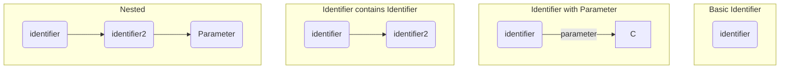

<!-- (dl
(section-meta
    (title Syntax Overview)
    (id structure)
)
) -->

The basic structure of Doculisp is all code is contained within blocks. A block is constructed within an HTML comment region. It starts with an open parentheses `(` followed by a sting of non-whitespace characters. This is called an identifier. It then has 1 of three possibilities. It can have a parameter, a new block, or nothing. All blocks must close with a close parentheses `)`.

Even the Doculisp main block follows this.

Example

```markdown
<!--
(dl
    (section-meta
        (title Basic Structure)
    )
)
-->
```

The first block is the `dl` block. In it `dl` is the identifier. It contains the `section-meta` sub-block.  That block has the identifier `section-meta` followed by a further sub block. The last sub block is the `title` sub block. In it `title` is the identifier and `Basic Structure` is the parameter.

<!-- (dl (#struct-param Parameter)) -->

A parameter is a string of characters that contains no line advancement (`\r` or `\n`) character and no parentheses (unless escaped). A parameter has a max length of 255 characters.

Example:

```doculisp
(identifier parameter)
```

To include parentheses within a parameter, escape them with a backslash:

```doculisp
(identifier parameter\))
```

<!-- (dl (#struct-visual More Visual Explanations)) -->

```doculisp
(identifier)
(identifier parameter)
(identifier (identifier2))
(identifier (identifier2 second parameter))
```

